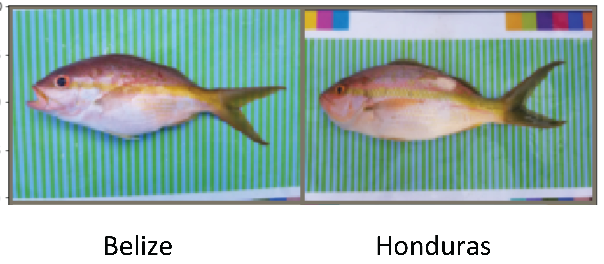

# fish-morphometrics

**Goal**

Successfully assign fish to their fishing ground of origin with a high level of accuracy from photographic images. Firstly, be able to distinguish fish from the fisheries of Belize and Honduras, and secondly, assign fish to their fishing grounds.

**Objectives:**

1. Understand the data and figure possible issues with images, such as inconsistent backgrounds, orientations of images, and the brightness of images. Look through the misclassified images to see what other transformations can be done.

2. Distinguish the fishes in the two countries. The data have two kinds of background, one is a white background and the other one is blue/white strips. Handle class imbalances. 

3. Classify fishes into their fishing grounds. 

## Introduction

Fisheries management includes managing exploited fish populations, estimating maximum sustainable yield, and setting catch limits. Currently, fisheries management is expensive since it requires a huge amount of labor work, therefore the majority of the world’s fish grounds remain unmanaged. An automated way to identify fish ground is of urgent need. 

One recent study from the Smithsonian Institute in 2018[1] utilizes genetic analysis, microchemistry, and morphometrics to identify fish origins, they found out that morphometrics analysis is cost-effective and accurate to assign fish ground in 5-10 km geographical ranges. Also, they found that there are distinct shapes in different fishing grounds of yellow snapper fish, which suggests that it is possible to automate the morphometric analysis using digital images of sample fish and to incorporate these results into a user-friendly system that could be easily interpreted by other stakeholders.

Image classification is a complex supervised learning problem and has been an important topic in the field of computer vision. Image classification problems in our project range from binary classification like identifying which country the fish comes from to multiclass classification such as identifying the specific fishing ground. An image classification problem is usually solved by pre-processing images, extracting features from images, training models, and classifying the target object. Deep learning models have been widely used in image classification problems, however, deep neural networks are usually difficult to train due to tremendous parameters. Thus, we will use a ResNet34 model[2] that presents a residual learning framework, which is easier to optimize and gains accuracy from deeper networks.

## Data

**Purpose of section:**

Our data are fish images from different fishing grounds in Belize and Honduras. We need to understand the data and figure possible issues with images, such as inconsistent backgrounds, orientations of images, and the brightness of images. 

**Image Count**

The table below showed the original image counts of two countries and five fishing grounds (after regrouping based on their locations). We are experiencing bad qualities of images of Seco en Medio. We will try to solve those issues afterward.

*Table 1. Distributions of Fish in Two Countries*

|          | Lane Snapper | White Grunt | Yellow Snapper |
|----------|--------------|-------------|----------------|
| Honduras | -            | 52          | 233            |
| Belize   | 408          | 45          | 422            |

*Table 2. Distributions of Fish in Fishing Grounds after Adjustment*

|               | Training | Validation |
|---------------|----------|------------|
| Banco Tino    | 116      | 27         |
| Grunt Patch   | 86       | 19         |
| Harvest Caye  | 144      | 34         |
| Jack Bank     | 101      | 24         |
| Seco en Medio | 9        | 4          |

**Potential Image Issues**

*Imbalanced Data*

From tables 1 and 2, we had imbalanced labeling data. For countries, the amount of images from Belize is about twice of Honduras.

*Color of Fish*

We observed some color differences that are not from the fish itself but probably from different daylights or angles when taking those pictures. So, we may try to adjust them with greyscale technique. Even though this will ignore color diversity if fish in Belize and Honduras truly have different colors.

*Figure 1. Color difference of images from two countries*

*Brightness*

We also observed obvious brightness differences between Belize and Honduras. It seems images from Honduras are brighter than those from Belize. We will adjust the brightness to the same scale when doing data preprocessing.

*Figure 2. Brightness difference of images from two countries*

*Figure 3. Grayscale and brightness adjust eliminate the color and brightness difference*

*Stripes of background*

Originally, we didn't want to consider images with stripe backgrounds. While after exploring the raw data, we found available images were limited. Therefore we decided to bring in those with stripe backgrounds. The problem is whether those stripes in backgrounds will disturb prediction models when extracting useful features. We tested some models with shallow convolutional layers. The results are shown below:

*Figure 4. Stripe of background results in noise features*

The models can extract the contour of fish as well as detailed information such as mouth, eyes, and so on. If we carefully observe the backgrounds, we can still see stripes from those images originally having stripe backgrounds. We need to explore this potential issue when training models.

*Color markers on the edges/corners*

Since the raw images were used as samples in biostatistical and chemical methodologies, many of them have color panels at edges and corners. Those objects in raw images will be noise for CNN models therefore we will center crop raw images in order to remove those noise.

*Figure 5. Center cropping captures only features from fishes*

## Methods

1. ResNet-34
2. Incection-V3

## Models and Results

**Data Split**

We split raw data into training and validation by 4:1 and applied data augmentation methods only to training data. All raw data will be used as testing data.

**Model settings**

We used pre-trained ResNet-34 as the initial model. We resized raw training images as 100x150, and center cropped as 70x150, and then random cropped as 50x100. Then we randomly horizontal flipped raw training images (rate = 0.5) and adjusted brightness to 0.1. The number of total training epochs is 100. The learning rate is set to 0.1 and decays at 50 and 75 epochs with a 0.1 decay rate. The loss function is Cross Entropy. The optimizer is SGD with L2 norm regularization (lambda = 0.0002).

**Classification of countries**

*Table 3 Prediction accuracy of classification of countries*

|                              | Tested on raw images | Tested on center cropping images |
|------------------------------|----------------------|----------------------------------|
| Model with RGB inputs        | 97.57%               | 96.55%                           |
| Model with Grey-scale inputs | 89.25%               | 86.41%                           |

The best accuracy is 97.57%.  We explored misclassified images and found for Belize, there were only two misclassified images. Both of them are with stripe backgrounds. As to Honduras, 10 images were misclassified. 9 of them are with stripe backgrounds. Therefore, as we assumed, stripe backgrounds are the challenges of prediction models.

*Figure 8 Misclassified Images of Belize*

**Classification of fishing grounds**

*Table 4 Prediction accuracy of classification of fishing grounds*

|                              | Tested on raw images | 
|------------------------------|----------------------|
| Model with RGB inputs        | 97.29%               | 

The best accuracy is 61.71%. Since all models have a bad performance, we broke into each fishing ground to see what happened.

*Table 5. Summary of classification of fishing grounds*

|               | Banco Tino | Grunt Patch + Harvest Cay + Jack Bank | Seco en Medio | Accuracy |
|---------------|------------|---------------------------------------|---------------|----------|
| Banco Tino    | 110        | 1                                     |0              | 99.10%   |
| Grunt Patch + Harvest Caye + Jack Bank| 2 | 319| 2             | 99.38%    |
| Seco en Medio | 10         | 1| 74             | 87.06%    |

## References

[1] Canty, Steven WJ, Nathan K. Truelove, Richard F. Preziosi, Simon Chenery, Matthew AS Horstwood, and Stephen J. Box. "Evaluating tools for the spatial management of fisheries." Journal of Applied Ecology 55, no. 6 (2018): 2997-3004.

[2] He, Kaiming, Xiangyu Zhang, Shaoqing Ren, and Jian Sun. "Deep residual learning for image recognition." In Proceedings of the IEEE conference on computer vision and pattern recognition, pp. 770-778. 2016.

[3] Girshick, Ross. "Fast r-cnn." In Proceedings of the IEEE international conference on computer vision, pp. 1440-1448. 2015
